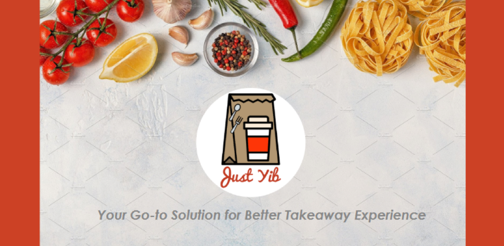

> This application is DEMO application only.
> You cannot order or have real payment on it

# Table of Content

[[toc]]

##  What is JustYib?

JustYib is an application that is specifically designed to enhance customer takeaway experience. Our users would be able to order their food and beverages, choose the suitable pickup time, and make payment through our platform.

## Problem that We are Trying to Solve?

The main problem that the customers are currently facing with the food and beverages market is that they must wait to order their meals, wait for their meals to be prepared, wait to pay for their meals, and then wait to fully enjoy their meals. These lengthy and unnecessary processes can be eliminated once JustYib launches its application.

## What We Do?

1. Order your food and/or drinks
2. Choose the pickup time
3. Make payment through our platform by using credit/debit card or mobile banking.
4. Collect your member points to receive discounts on your next purchase. 

## Target Customers

People at the age of 18-40, who are currently living in Bangkok.

### Behavioral Aspects

1. Addicted to smartphone
2. Live life in a fast pace
3. Love convenient lifestyle
4. Modern and trendy

## Why Us?

We are capable individuals who feel the urgency to solve this customer’s pain point. From our experience, we strongly believe that JustYib application could become an innovative all-in-one service application that provide convenience for our targeted users. Our value proposition is that we give back our customers their precious time by reducing the prementioned lengthy processes. The application is free and the customers can decide their own pickup time.
  
Furthermore, we are extensively differentiated from our competitors in several ways. The application is free and enables customers to decide their own pickup time. JustYib focuses on renown domestic restaurants and coffeeshops and tries to incorporate diversity concept in the business model. In this way, our users can get the richness of their nutrition.

<FooterEn />
